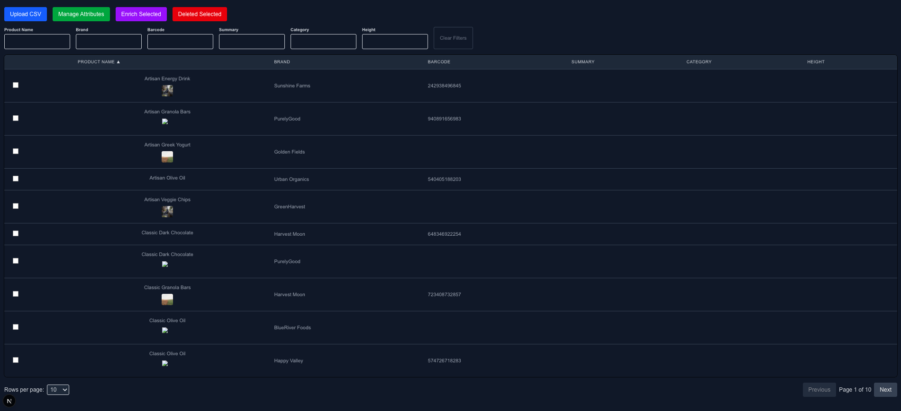
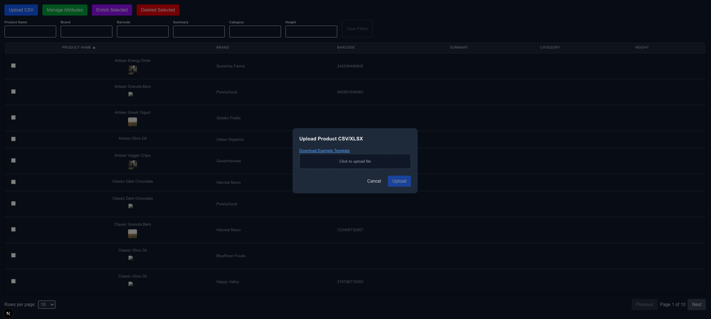
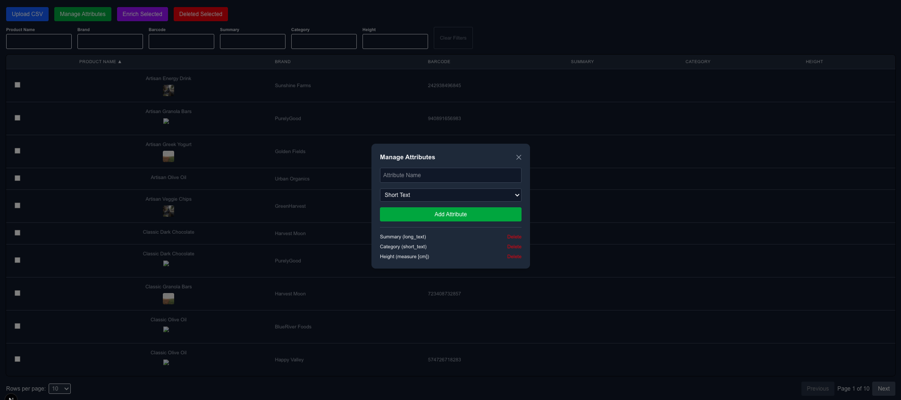
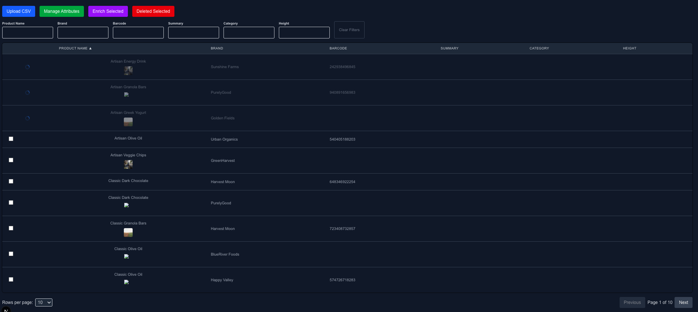
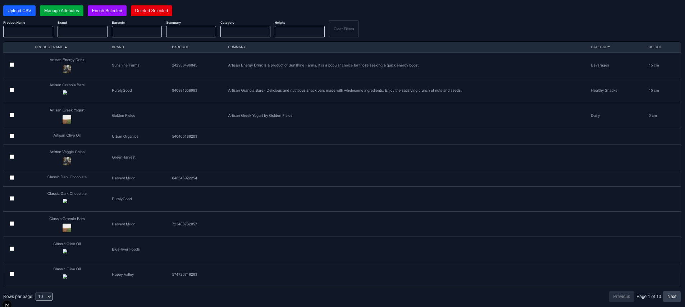

# enrich-product-frontend

> Frontend portion of the Product Enrichment System.  
> Built using **Next.js 15 (App Router)** and **TailwindCSS**, designed for flexible deployment under a **serverless architecture** using the Serverless Framework.

---

## Table of Contents

- [Screenshots](#screenshots)
- [Tech Stack](#tech-stack)
- [Installation](#installation)
- [Available Commands](#available-commands)
- [Features](#features)
- [Project Structure](#project-structure)
- [API Integration](#api-integration)
- [Future Enhancements](#future-enhancements)
- [Notes](#notes)
- [License](#license)

---

## Screenshots

### Main Screen



### Upload Modal



### Manage Attributes Modal



### Items Enrichment Processing

Select the checkbox of the items to be processed and press the Enrich Selected Button



### Items Enrichment Results

When the processing is done, it will show the enrichment results in the row



## Tech Stack

- **Next.js 15** (App Router)
- **React 19**
- **TypeScript**
- **TailwindCSS**
- **Headless UI** (for dialogs and modals)
- **Axios** (for API calls)
- **react-hot-toast** (for user notifications)
- **Serverless Framework** (for deployment simulation)

---

## Installation

### Prerequisites

- Node.js v22.6.0 (recommend using [nvm](https://github.com/nvm-sh/nvm))
- Backend API running locally (`enrich-product-backend`) https://github.com/jfaylon/enrich-product-backend

---

### Setup Steps

1. **Clone the repository**

   ```bash
   git clone https://github.com/jfaylon/enrich-product-frontend.git
   cd enrich-product-frontend
   ```

2. **Install dependencies**

   ```bash
   npm install
   ```

3. **Configure environment variables**

   Copy `.env.example` to `.env.local`:

   ```bash
   cp .env.example .env.local
   ```

   Edit `.env.local` to point to your backend:

   ```env
   NEXT_PUBLIC_API_URL=http://localhost:3000
   ```

   ✅ `NEXT_PUBLIC_API_URL` is used internally by Axios to call backend APIs.

4. **Run the application**

   #### For local development (Next.js dev server):

   ```bash
   npm run dev
   ```

   - Frontend available at [http://localhost:3001](http://localhost:3001) (or port 3000 if configured)

   #### For serverless offline simulation:

   ```bash
   npm run offline
   ```

   - Simulates frontend being served from a serverless architecture locally.

---

## Available Commands

| Command           | Description                                                      |
| :---------------- | :--------------------------------------------------------------- |
| `npm run dev`     | Start the frontend using the built-in Next.js development server |
| `npm run offline` | Run the frontend under serverless-offline simulation             |
| `npm run build`   | Build the frontend for production                                |
| `npm run start`   | Start the frontend in production mode after build                |

---

## Technical Discussions

### Why Next.js 15 (App Router) was chosen

- **Serverless-ready**: Next.js App Router naturally fits serverless deployments by splitting pages and APIs into independent units.
- **Fullstack capabilities**: Allows API routes and server components to live together.
- **Optimized performance**: Out-of-the-box support for automatic static generation, image optimization, and React streaming.
- **Modern architecture**: Supports server components, nested layouts, and fine-grained caching.
- **Developer experience**: Powerful CLI tooling, excellent TypeScript support, and mature ecosystem.

---

## Technical Limitations

- **Local-Only Serverless Simulation**:  
  Production-ready deployment (Vercel, AWS, etc.) is not finalized yet — only local simulation via `serverless offline`.

- **Authentication and Authorization Not Implemented**:  
  Open access to APIs assumed — route protection, login, and session management are future tasks.

- **Real-Time Updates Missing**:  
  Currently uses polling. WebSocket or SSE real-time updates are not yet implemented and will be considered if scaling demands arise.

- **Backend Availability Dependency**:  
  Frontend relies entirely on backend availability; no local offline caching for dynamic content.

- **Limited API Error Handling**:  
  Basic try-catch error handling exists, but better user-facing error flows are needed (e.g., user-friendly error pages).

- **Middleware for Route Protection Pending**:  
  Next.js Middleware can enforce protected routes dynamically but is not yet activated.

- **Static File CDN Optimization Missing**:  
  Static files are served locally; production should migrate to a CDN-backed system (e.g., Vercel static files, S3 + CloudFront).

---

## Future Enhancements

- **Authentication and Protected Routes**:  
  Integrate user authentication to secure certain pages.  
  Leverage Next.js **Middleware** to manage protected routes, automatically redirect unauthorized users, and inject or remove user-specific data in server-rendered pages.

- **Advanced API Error Handling**:  
  Improve resilience by showing user-friendly error pages for backend/API failures. Gracefully handle 500-level errors and network interruptions.

- **Real-time Updates via WebSocket/SSE (Conditional)**:  
  If scaling requirements arise (e.g., many concurrent users, frequent enrichment jobs), implement real-time updates using WebSockets or Server-Sent Events (SSE) to push enrichment statuses dynamically instead of relying on client-side polling.

- **Role-Based Access Control (RBAC)**:  
  Introduce permission-based access to specific frontend features depending on user roles (e.g., Admin vs Member vs Guest).

- **PWA (Progressive Web App) Enhancements**:  
  Add service workers to enable offline support, faster load times, and better mobile experiences.

- **Production Serverless Deployment**:  
  Finalize deployment by either configuring the Serverless Framework (AWS Lambda@Edge, CloudFront Distribution) or exploring native serverless hosting platforms such as **Vercel**, **AWS Amplify**, or **Netlify** to optimize for scalability, performance, and developer experience.

- **Improved Dynamic Filtering and Sorting**:  
  Enhance product table with multi-attribute filtering, search across multiple fields, and advanced client-side sorting optimizations.

- **Analytics and Monitoring Integration**:  
  Embed tools like Vercel Analytics, LogRocket, or Sentry (already discussed for backend) to track frontend performance and capture client-side errors.

- **UI/UX Polish and Consistent Branding**:  
  Enhance the visual design by standardizing typography, color palette, spacing, and component styling.  
  Align the frontend with a consistent brand identity and improve user experience across pages, as the current implementation focuses primarily on core functionality (MVP).

## Notes

- The backend must be running before starting the frontend.
- Ensure `NEXT_PUBLIC_BACKEND_API_URL` matches your backend environment.
- `serverless offline` simulates serverless deployment locally but is not actual production deployment yet.
- Static files are served from `/public` during local development.
